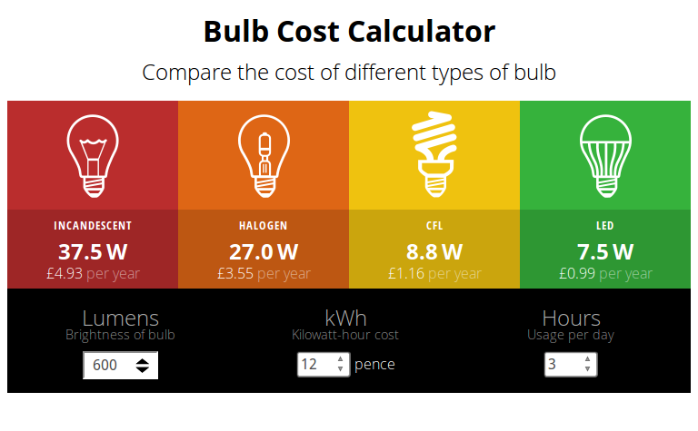

# Bulb Cost Calculator
## A simple AngularJS App

This is the AngularJS app I built while completing the [Lyda.com][1] AngularJS
course [Creating a Calculation Tool with AngularJS 1][2]. I have made the code
more readable than what was taught in the course and added a few more finishing
touches.

## What the app does
The app compares the cost of running different types of bulbs, depending on the
price of electricity and how many hours a day the bulb is used. The user can
also set the brightness of the bulb, so they can see what the equivalent bulb
wattage is across all the different types of bulbs.

## How to run the app
Simply load the `index.html` file in your modern browser.

## Required Libraries and Dependencies
A copy of AngularJS is included in the repository. There are no other
dependencies.

## Project contents
This project consists for the following files:

* `index.html` - the main HTML file to directly load in a browser
* `assets/` - directory containing images, JavaScript and CSS files
    + `images/` - directory containing images of bulbs, arrows and screen shot
    + `angular.min.js` - a compressed version on the AngularJS library
    + `calculator.css` - the cascading style sheet for the app
    + `calculator.js` - where the AngularJS app and a controller is defined

## How to contribute
Got an idea of how to make the bulb calculator better? Then submit a pull
request to get the balling rolling.

[1]: https://www.lynda.com
[2]: https://www.lynda.com/AngularJS-tutorials/Creating-Calculation-Tool-AngularJS/424042-2.html
